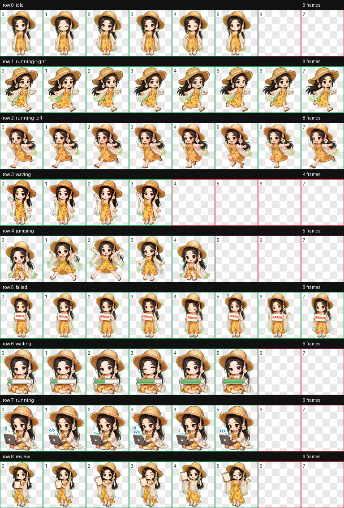

# codex_pet_Jane1

Jane1 Pet is a small animated desktop companion. It floats above your desktop, can be dragged around, and plays Jane1's idle, waving, working, waiting, jumping, running, review, and failed animations.

Jane1 Pet 是一个可爱的桌面宠物应用。它会悬浮在桌面上，可以拖动位置，并支持 Jane1 的待机、招手、工作、等待、跳跃、跑动、待查看和失败反馈等动作。



## English

### Features

- Transparent frameless desktop pet window.
- Always-on-top companion that can be dragged around.
- Built-in Jane1 animation frames under `assets/sprites`.
- Tray menu for quick actions.
- Windows and macOS packaging through Electron Builder.
- GitHub Actions workflow for release builds.

### Quick Install

There are two ways to use Jane1:

- Codex appearance pet: install `codex-pet/jane1` into your Codex pets folder.
- Standalone desktop app: download or build the Electron app.

For Codex, copy this folder:

```text
codex-pet/jane1/
```

to:

```text
Windows: C:\Users\<your-user-name>\.codex\pets\jane1
macOS:   ~/.codex/pets/jane1
```

Then restart Codex and select Jane1 in the appearance or pet settings.

For the standalone app, download a release package from GitHub Releases:

1. Open the repository Releases page.
2. Download the package for your system.
3. Run Jane1 Pet.

Recommended files:

- Windows installer: `Jane1 Pet-*-win-x64.exe`
- Windows portable app: `Jane1 Pet-*-win-x64.exe` or `*.zip`, depending on the release asset
- macOS disk image: `Jane1 Pet-*-mac-x64.dmg` or `Jane1 Pet-*-mac-arm64.dmg`
- macOS zip app: `Jane1 Pet-*-mac-*.zip`

### Windows Installation Methods

#### Method 1: Installer

Download the Windows NSIS installer from Releases and run it:

```powershell
Jane1-Pet-0.1.0-win-x64.exe
```

Choose the install directory, then launch Jane1 Pet from the Start Menu or desktop shortcut.

#### Method 2: Portable Version

Download the portable Windows build from Releases, place it anywhere, and double-click it. This is useful when you do not want to install the app.

#### Method 3: Run from Source

Install Node.js 20 or newer, then run:

```powershell
git clone https://github.com/your-name/codex_pet_Jane1.git
cd codex_pet_Jane1
npm install
npm run dev
```

#### Method 4: Build Locally

```powershell
npm install
npm run dist:win
```

The generated installer, portable build, and zip package will be in `dist/`.

### macOS Installation Methods

#### Method 1: DMG

Download the `.dmg` file from Releases, open it, and drag Jane1 Pet into Applications.

If macOS blocks the app because it is unsigned, open it from:

```text
System Settings -> Privacy & Security -> Open Anyway
```

#### Method 2: ZIP App

Download the macOS zip file, unzip it, and move `Jane1 Pet.app` into Applications.

If needed, clear the quarantine flag:

```bash
xattr -dr com.apple.quarantine "/Applications/Jane1 Pet.app"
```

#### Method 3: Run from Source

Install Node.js 20 or newer, then run:

```bash
git clone https://github.com/your-name/codex_pet_Jane1.git
cd codex_pet_Jane1
npm install
npm run dev
```

#### Method 4: Build Locally

```bash
npm install
npm run dist:mac
```

The generated `.dmg` and `.zip` files will be in `dist/`.

### Developer Commands

```bash
npm run dev        # Start Jane1 Pet in development mode
npm run lint:json  # Validate that every animation frame exists
npm run pack       # Create an unpacked app directory
npm run dist       # Build release packages for the current OS
```

### Project Structure

```text
codex_pet_Jane1/
  codex-pet/
    jane1/
      pet.json
      spritesheet.webp
  assets/
    actions.json
    sprites/
      idle/
      running/
      review/
      failed/
      waiting/
      jumping/
      running-right/
      waving/
      running-left/
  docs/screenshots/
  src/
    main.js
    preload.js
    renderer.html
    renderer.js
    styles.css
  scripts/
    validate-actions.js
```

### Release Workflow

To build release packages automatically:

1. Push the project to GitHub.
2. Create a version tag:

```bash
git tag v0.1.0
git push origin v0.1.0
```

3. GitHub Actions will build Windows and macOS artifacts.
4. Download the artifacts from the workflow run and upload them to a GitHub Release.

### Asset Notes

Jane1 animation frames are stored as PNG files in `assets/sprites`. The app reads `assets/actions.json`, so all paths must stay relative to the project root.

The Codex appearance pet package is stored in `codex-pet/jane1`. It contains only the files Codex needs: `pet.json` and `spritesheet.webp`.

If you add a new action:

1. Add a new folder under `assets/sprites/<action-id>/`.
2. Put frames named `00.png`, `01.png`, and so on.
3. Add the action to `assets/actions.json`.
4. Run `npm run lint:json`.

## 中文

### 功能

- 透明无边框桌面宠物窗口。
- 始终置顶，可拖动。
- 内置 Jane1 动作帧，位于 `assets/sprites`。
- 托盘菜单可快速切换动作。
- 支持用 Electron Builder 打包 Windows 和 macOS 应用。
- 内置 GitHub Actions，可自动构建发布包。

### 快速安装

Jane1 有两种使用方式：

- Codex 外观宠物版：把 `codex-pet/jane1` 安装到 Codex 的 pets 目录。
- 独立桌面应用版：下载或自行打包 Electron 应用。

Codex 外观宠物版安装方法：

```text
复制 codex-pet/jane1/
```

到：

```text
Windows: C:\Users\<你的用户名>\.codex\pets\jane1
macOS:   ~/.codex/pets/jane1
```

然后重启 Codex，在外观或宠物设置里选择 Jane1。

如果要使用独立桌面应用版，可以从 GitHub Releases 下载已经打好的安装包：

1. 打开项目的 Releases 页面。
2. 下载适合你系统的文件。
3. 运行 Jane1 Pet。

推荐下载：

- Windows 安装包：`Jane1 Pet-*-win-x64.exe`
- Windows 便携版：Release 中的 portable 或 zip 文件
- macOS 安装镜像：`Jane1 Pet-*-mac-x64.dmg` 或 `Jane1 Pet-*-mac-arm64.dmg`
- macOS 压缩包：`Jane1 Pet-*-mac-*.zip`

### Windows 安装方法

#### 方法一：安装包

从 Releases 下载 Windows 安装包并运行：

```powershell
Jane1-Pet-0.1.0-win-x64.exe
```

安装时可以选择目录。安装完成后，可以从开始菜单或桌面快捷方式启动。

#### 方法二：便携版

从 Releases 下载便携版，把文件放到任意目录后双击运行。这个方法不需要安装，适合临时体验。

#### 方法三：从源码运行

先安装 Node.js 20 或更高版本，然后运行：

```powershell
git clone https://github.com/your-name/codex_pet_Jane1.git
cd codex_pet_Jane1
npm install
npm run dev
```

#### 方法四：本地打包 Windows 安装包

```powershell
npm install
npm run dist:win
```

生成的安装包、便携版和 zip 文件会在 `dist/` 目录中。

### macOS 安装方法

#### 方法一：DMG 安装

从 Releases 下载 `.dmg` 文件，打开后把 Jane1 Pet 拖入 Applications。

如果 macOS 提示应用未签名，可以到这里允许打开：

```text
系统设置 -> 隐私与安全性 -> 仍要打开
```

#### 方法二：ZIP 版本

下载 macOS zip 文件，解压后把 `Jane1 Pet.app` 移动到 Applications。

如果系统阻止打开，可以执行：

```bash
xattr -dr com.apple.quarantine "/Applications/Jane1 Pet.app"
```

#### 方法三：从源码运行

先安装 Node.js 20 或更高版本，然后运行：

```bash
git clone https://github.com/your-name/codex_pet_Jane1.git
cd codex_pet_Jane1
npm install
npm run dev
```

#### 方法四：本地打包 macOS 应用

```bash
npm install
npm run dist:mac
```

生成的 `.dmg` 和 `.zip` 文件会在 `dist/` 目录中。

### 开发命令

```bash
npm run dev        # 开发模式启动 Jane1 Pet
npm run lint:json  # 检查所有动作图片是否存在
npm run pack       # 生成未压缩的应用目录
npm run dist       # 为当前系统生成发布包
```

### 项目结构

```text
codex_pet_Jane1/
  codex-pet/
    jane1/
      pet.json
      spritesheet.webp
  assets/
    actions.json
    sprites/
      idle/
      running/
      review/
      failed/
      waiting/
      jumping/
      running-right/
      waving/
      running-left/
  docs/screenshots/
  src/
    main.js
    preload.js
    renderer.html
    renderer.js
    styles.css
  scripts/
    validate-actions.js
```

### 发布流程

自动构建发布包的方法：

1. 把项目推送到 GitHub。
2. 创建版本标签：

```bash
git tag v0.1.0
git push origin v0.1.0
```

3. GitHub Actions 会自动构建 Windows 和 macOS 包。
4. 从 Actions 页面下载构建产物，再上传到 GitHub Release。

### 素材说明

Jane1 的动作帧保存在 `assets/sprites`。应用通过 `assets/actions.json` 读取动作，因此路径必须保持项目内相对路径，不能写成本机绝对路径。

Codex 外观宠物包保存在 `codex-pet/jane1`，里面只有 Codex 需要的两个文件：`pet.json` 和 `spritesheet.webp`。

如果要新增动作：

1. 在 `assets/sprites/<action-id>/` 新建动作目录。
2. 放入 `00.png`、`01.png` 等连续帧。
3. 在 `assets/actions.json` 中添加动作配置。
4. 运行 `npm run lint:json` 检查素材。

## License

Code is released under the MIT License. Make sure you have the right to publish and redistribute the Jane1 artwork before making the repository public.
